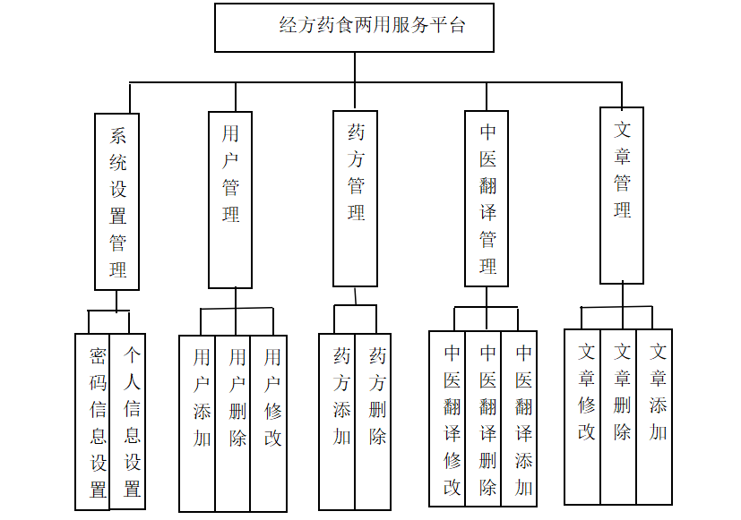
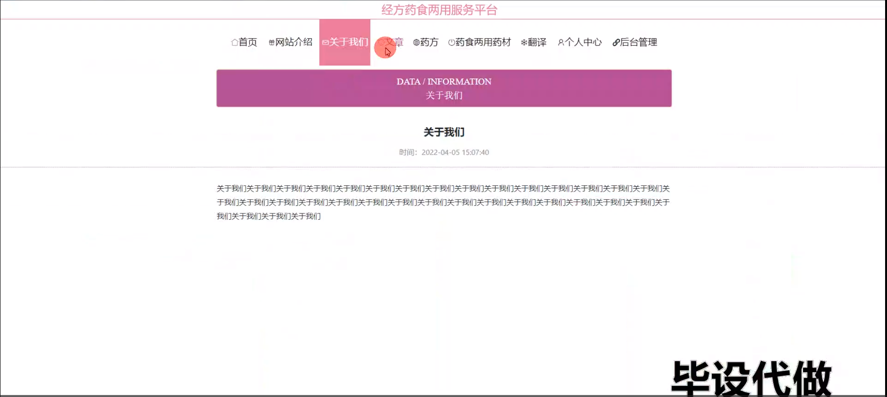
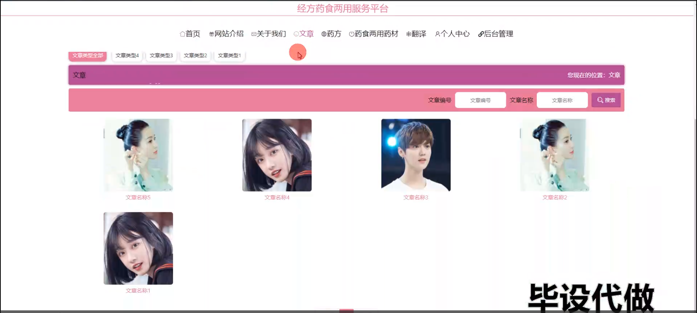
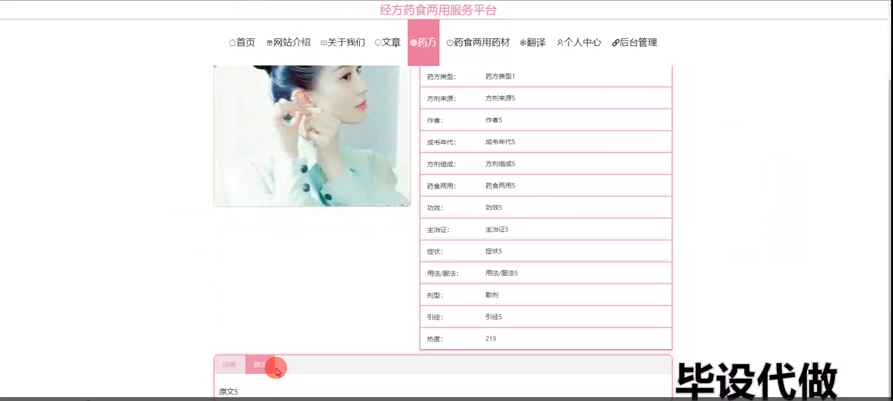
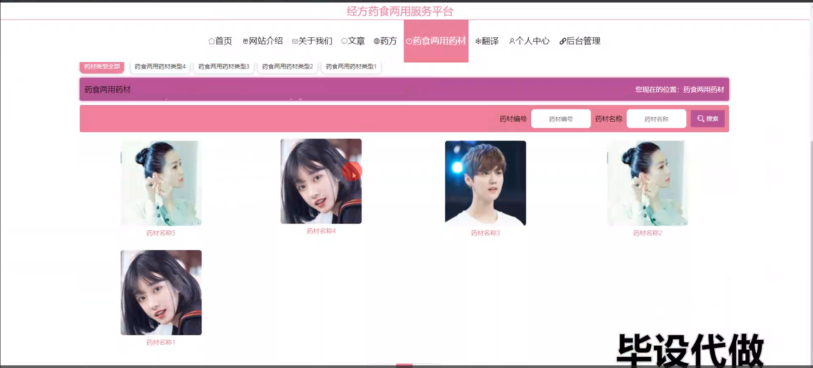
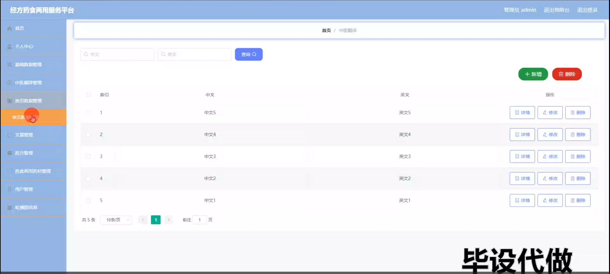
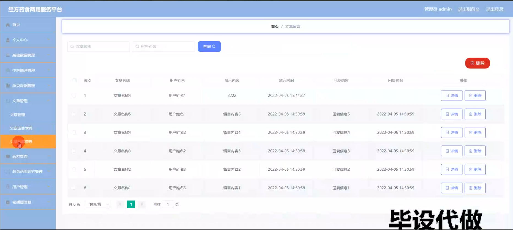
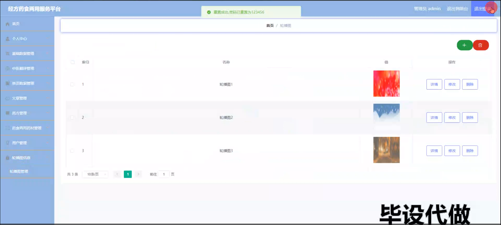
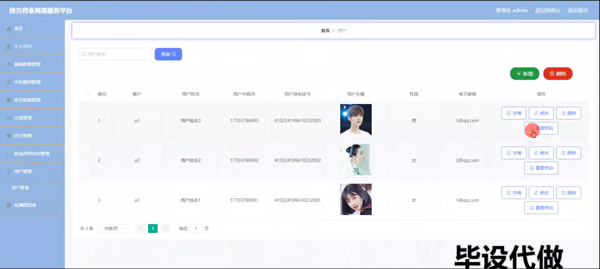
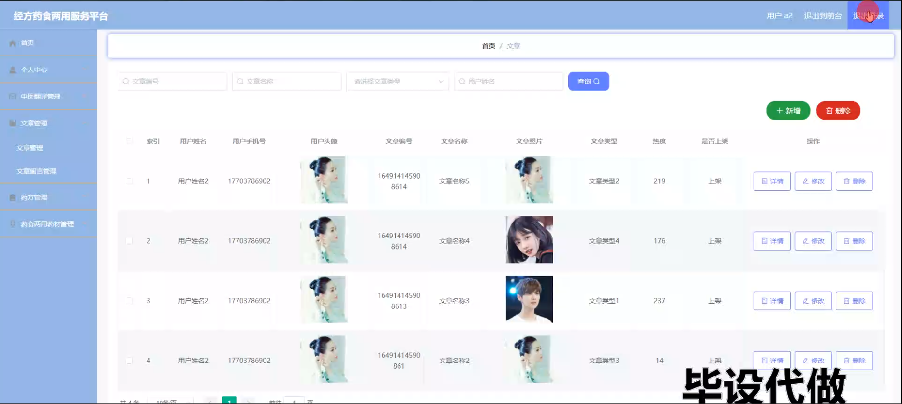

# 计算机毕业设计不知道选题-参考基于springboot的经方药食两用服务平台

#### 介绍

基于Spring Boot的经方药食两用服务平台是一款专为中医药和药食同源药材管理及服务设计的综合性平台。该系统旨在为用户提供全面的中医药知识、药方信息以及药食两用药材的管理和服务。系统拥有管理员和用户两种角色，分别用于系统的全面管理和具体信息的查询与操作。平台通过模块化设计，实现了中医药数据的规范管理和信息的高效传递，帮助用户更好地理解和应用中医药知识。

#### 研究背景

信息化管理模式是将行业中的工作流程由人工服务，逐渐转换为使用计算机技术的信息化管理服务。这种管理模式发展迅速，使用起来非常简单容易，用户甚至不用掌握相关的专业知识，根据教程指导即可正常使用相关的系统，因而被越来越多的用户所使用。由于相关行业管理信息化，这就使得管理工作不在受到时间和区域的限制，随时随地即可完成相关的工作任务和结果[1]。就目前而言，管理信息化在现代社会中非常流行，使用比较广泛。早在20世纪70年代末，就出现了早期的电子商务，相关的公司企业使用计算机建立专用的内部网络，通过内部网络完成相应的采购、销售等活动，加快相关的企业之间的交易速度，提高了工作效率[2]。
当下，许多行业采用互联网技术将工作流程信息化、数字化，提高了相关人员的服务质量和效率，节约了相关行业的人力、财力、物力等资源，与此同时，人们获取外界的相关信息主要依赖于主流的信息化技术和工具。人们对生活的需求也在不断的发生着变化，为了应对用户的多样化需求，许多相关的第三产业应运而生，管理信息化也逐渐的流行起来，比如电子商务行业。本人通过查询大量学习资料，了解基本的开发系统的基本背景和关键任务，学习与掌握Java语言、web技术、AJAX技术、HTML语言等开发技术，设计系统功能模块，以及MySQL数据库的相关语法和工具，创建和存储数据表格，反映和关联表格之间相互存在的关系，由此对经方药食两用服务平台进行研发和实现。

#### 技术栈

后端技术栈：Springboot+Mysql+Maven

前端技术栈：Vue+Html+Css+Javascript+ElementUI

开发工具：Idea+Vscode+Navicate

#### 系统功能介绍

管理员角色功能模块  
个人中心：管理员可以在个人中心查看和管理个人信息，进行密码修改等操作，确保账户的安全性。  
基础数据管理：管理员可以管理系统的基础数据，包括药材信息、药方信息等，确保系统数据的准确性和完整性。  
中医翻译管理：管理员可以管理中医药相关的翻译内容，确保翻译信息的规范和准确。  
单页数据管理：管理员可以管理系统中的单页数据，如网站介绍、关于我们等页面的信息。  
文章管理：管理员可以发布、修改和删除中医药相关的文章，确保知识的及时传播和更新。  
药方管理：管理员可以管理中医药方的信息，包括药方的创建、修改和删除。  
药食两用药材管理：管理员可以管理药食两用药材的信息，确保药材信息的准确性和全面性。  
用户管理：管理员可以管理系统内所有用户的信息，分配权限和角色，确保系统的正常运作。  
轮播图信息管理：管理员可以管理系统首页的轮播图信息，确保图片内容的及时更新和展示效果。  

用户角色功能模块  
网站介绍：用户可以查看平台的基本介绍，了解平台的功能和作用。  
关于我们：用户可以查看平台的背景信息，了解平台的开发初衷和目标。  
文章：用户可以浏览和阅读中医药相关的文章，获取最新的中医药知识和资讯。  
药方药食两用药材：用户可以查看和查询药方及药食两用药材的信息，获取详细的使用方法和功效介绍。  
翻译：用户可以使用平台提供的翻译功能，获取中医药相关内容的翻译信息。  
个人中心：用户可以在个人中心查看和管理个人信息，进行密码修改等操作，确保账户的安全性。  
后台管理：  
个人中心：用户可以在后台管理中查看和管理个人信息，确保账户的安全性。  
中医翻译管理：用户可以在后台管理中查看和管理中医药相关的翻译内容。  
文章管理：用户可以在后台管理中发布、修改和删除文章，确保知识的及时传播和更新。  
药方管理：用户可以在后台管理中管理药方的信息，确保药方信息的准确性和完整性。  
药食两用药材管理：用户可以在后台管理中查看和管理药食两用药材的信息。  

#### 系统功能设计

本系统主要通过使用Java语言编码设计系统功能，MySQL数据库管理数据，AJAX技术设计简洁的、友好的网址页面，然后在IDEA开发平台中，编写相关的Java代码文件，接着通过连接语言完成与数据库的搭建工作，再通过平台提供的Tomcat插件完成信息的交互，最后在浏览器中打开系统网址便可使用本系统。本系统的使用角色可以被分为用户和管理员，用户具有注册、查看信息、留言信息等功能，管理员具有修改用户信息，发布新闻等功能，系统总体功能设计图如下。

#### 系统作用

基于Spring Boot的经方药食两用服务平台在中医药信息化管理中发挥了重要作用：

提升管理效率：通过信息化手段，实现中医药信息的电子化和自动化，大大提高了管理效率。  
确保数据准确性：系统通过标准化的数据录入和管理流程，确保中医药数据的准确性和一致性，为用户提供可靠的信息。  
增强信息传播：系统提供了文章管理、药方管理和药食两用药材管理功能，确保中医药知识的及时传播和更新。  
优化用户体验：系统通过网站介绍、关于我们等模块，为用户提供了便捷的信息查询和服务体验。  
提高安全性：系统通过权限管理和数据加密等技术手段，确保中医药信息的安全性和隐私保护。  

#### 系统功能截图

登录

网站介绍

关于我们模块

文章模块

药方模块

药食两用药材

翻译模块

单页数据管理

文章管理

轮播图信息管理

用户管理

用户端后台管理

#### 总结

基于Spring Boot的经方药食两用服务平台通过全面的功能模块设计，实现了中医药信息的高效管理和传播，为中医药的现代化发展提供了强有力的技术支持。系统在提升管理效率、确保数据准确性和增强信息传播方面发挥了重要作用。然而，在实际应用中，系统可能还面临着扩展性和用户体验方面的挑战。未来，可以结合更多的智能技术，如大数据分析和人工智能，进一步提升系统的功能和性能，确保在应对各种中医药管理事务时，能够快速、准确、高效地进行管理和决策。通过不断的优化和升级，基于Spring Boot的经方药食两用服务平台将为中医药的发展提供更加坚实的保障。

#### 使用说明

创建数据库，执行数据库脚本 修改jdbc数据库连接参数 下载安装maven依赖jar 启动idea中的springboot项目

前台登录页面
http://localhost:8080/jingfangyaoshiliangyongfuwupingtai/front/index.html

后台登录页面
http://localhost:8080/jingfangyaoshiliangyongfuwupingtai/admin/dist/index.html

管理员				账户:admin 		密码：admin

用户				账户:a1 		密码：123456
